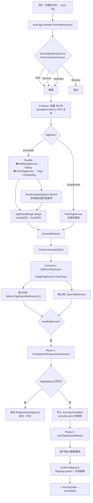
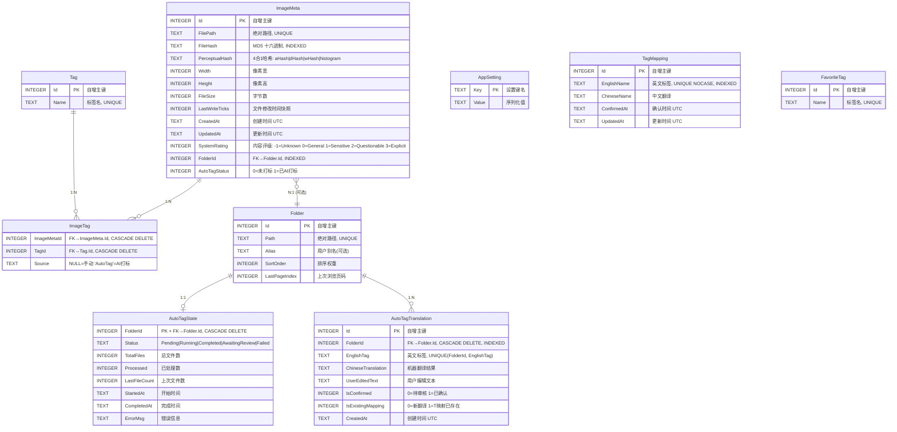

# ImageManager2 — 系统架构与全链路开发指南

> **版本**: 基于 `master` 分支 (2026-05-26)  
> **技术栈**: .NET 8 + Avalonia 12 + SQLite + ONNX Runtime + SkiaSharp  
> **作者**: 自动生成 (Claude Code 架构反向解析)

---

## 目录 (Table of Contents)

- [1. 项目概览 (Phase 1)](#1-项目概览-phase-1)
  - [1.1 技术栈与核心依赖](#11-技术栈与核心依赖)
  - [1.2 核心入口文件](#12-核心入口文件)
  - [1.3 项目目录结构](#13-项目目录结构)
- [2. 核心模块拆解 (Phase 2)](#2-核心模块拆解-phase-2)
  - [2.1 模块总览表](#21-模块总览表)
  - [2.2 各模块详细说明](#22-各模块详细说明)
- [3. 全链路串联与数据流 (Phase 3)](#3-全链路串联与数据流-phase-3)
  - [3.1 底层驱动机制](#31-底层驱动机制)
  - [3.2 链路一：图片浏览与缩略图加载](#32-链路一图片浏览与缩略图加载)
  - [3.3 链路二：AI 自动打标全流程](#33-链路二ai-自动打标全流程)
- [4. 底层架构与基础建设 (Phase 4)](#4-底层架构与基础建设-phase-4)
  - [4.1 状态与数据管理](#41-状态与数据管理)
  - [4.2 错误处理与日志](#42-错误处理与日志)
  - [4.3 配置管理](#43-配置管理)
- [5. 细节深化 (Phase 6)](#5-细节深化-phase-6)
  - [5.1 数据库设计与表结构](#51-数据库设计与表结构)
  - [5.2 DSL 标签搜索语法解析](#52-dsl-标签搜索语法解析)
  - [5.3 AI 推理与数据处理栈](#53-ai-推理与数据处理栈)
  - [5.4 架构优化代码落地指导](#54-架构优化代码落地指导)
- [6. 架构优化建议 (Phase 5)](#6-架构优化建议-phase-5)

---

## 1. 项目概览 (Phase 1)

### 1.1 技术栈与核心依赖

| 类别 | 技术/库 | 版本 | 说明 |
|------|---------|------|------|
| **运行时** | .NET 8.0 | LTS | 跨平台桌面应用 |
| **UI 框架** | Avalonia | 12.0.2 | 跨平台 XAML 框架 (WPF 精神继承者) |
| **UI 主题** | FluentTheme + Inter Font | 12.0.2 | 内置暗色/亮色主题 |
| **MVVM** | CommunityToolkit.Mvvm | 8.4.1 | `[ObservableProperty]` / `[RelayCommand]` 源生成器 |
| **DI 容器** | Microsoft.Extensions.DependencyInjection | 8.0.1 | 全应用单例注册 |
| **配置** | Microsoft.Extensions.Configuration.Json | 8.0.1 | JSON + Key-Value DB 混合配置 |
| **数据库** | SQLite (Microsoft.Data.Sqlite + Dapper) | 8.0.11 / 2.1.35 | WAL + 单文件 |
| **图像处理** | SkiaSharp | 3.116.1 | 跨平台 2D 图形 (JPEG/PNG/GIF/WebP) |
| **AI 推理** | ONNX Runtime GPU (CUDA) | 1.26.0 | 本地 GPU 加速推理，CPU 回退 |
| **视频播放** | LibVLCSharp | 3.9.7.1 | 全功能视频播放器 |
| **视频缩略图** | ffmpeg (外部进程) | — | 提取首帧 JPEG |
| **AI 翻译** | DeepSeek API | — | `deepseek-chat` 模型 |
| **日志** | 自研 AppLogger + MS Extensions Logging | — | 按日滚动文件 + Trace 输出 |

### 1.2 核心入口文件

| 入口 | 文件路径 | 职责 |
|------|----------|------|
| **程序入口** | `src/ImageManager.App/Program.cs:10` | `Main()` → `StartWithClassicDesktopLifetime(args)` : 52 行 |
| **DI 组合根** | `src/ImageManager.App/App.axaml.cs:27` | `ConfigureServices()` 注册全部 35+ 服务到 `ServiceProvider` |
| **主窗口** | `src/ImageManager.App/Views/MainWindow.axaml` | 6 行 2 列 Grid: 侧边栏(TreeView) + 工具栏 + 缩略图网格 |
| **MVVM 视图定位** | `src/ImageManager.App/ViewLocator.cs` | 约定映射: `FooViewModel` → `FooView` (反射创建) |

### 1.3 项目目录结构

```
ImageManager2/
├── ImageManager2.sln                          # 解决方案文件 (4 项目)
├── src/
│   ├── ImageManager.Common/                   # [共享层] 纯工具，零项目依赖
│   │   └── Helpers/
│   │       ├── AppLogger.cs                   #   线程安全按日滚动文件日志
│   │       ├── FileSizeFormatter.cs           #   byte → "1.5 MB" 格式化
│   │       └── PathHelper.cs                  #   路径规范化/冲突检测/扩展名判断
│   │
│   ├── ImageManager.Core/                     # [核心层] 仅含 POCO 模型 + 接口契约
│   │   ├── Models/                            #   6 个数据模型 (ImageMeta, TagCount 等)
│   │   └── Services/                          #   15 个服务接口 + 7 个辅助枚举/记录类型
│   │
│   ├── ImageManager.Infrastructure/           # [基础设施层] 所有接口的实现
│   │   ├── Data/
│   │   │   ├── AppDbContext.cs                #     SQLite 建表/迁移/连接工厂 (WAL + PRAGMA)
│   │   │   ├── DataMigrator.cs                #     旧 WPF JSON 数据迁移器
│   │   │   └── Repositories/                  #     6 个 Repository (Dapper)
│   │   ├── Caching/
│   │   │   ├── DiskThumbnailCache.cs          #     磁盘缓存 (MD5 分片目录)
│   │   │   └── ThumbnailCacheService.cs       #     二级缓存: 内存 LRU (50MB) + 磁盘
│   │   ├── Imaging/
│   │   │   └── ThumbnailGenerator.cs          #     SkiaSharp 缩略图生成 (SKCodec 原生缩放)
│   │   ├── Hashing/
│   │   │   └── HashService.cs                 #     MD5 + 4 重感知哈希 (aHash/dHash/wHash/直方图)
│   │   └── Services/
│   │       ├── OnnxTagServiceBase.cs          #     ONNX 模型抽象基类 (下载/预处理/推理/后处理)
│   │       ├── OnnxTagService.cs              #     Legacy WD14 SwinV2 标签器 (IAutoTagService)
│   │       ├── PixaiTagService.cs             #     PixAI v0.9: 标签 + 1024d Embedding
│   │       ├── CamieTagService.cs             #     Camie: 画师/版权识别 (仅 Ensemble)
│   │       ├── WdRatingService.cs             #     WD14 内容评级: General→Explicit
│   │       ├── SingleModelTagService.cs       #     模式 A: 仅 PixAI 全类别
│   │       ├── EnsembleTagService.cs          #     模式 B: WD Rating + PixAI + 画师
│   │       ├── TagServiceFactory.cs           #     工厂: TagMode → IEnsembleTagService
│   │       ├── TagResultMerger.cs             #     多模型结果合并 (Camie 优先 + PixAI 补齐)
│   │       ├── ChineseTagLibrary.cs           #     双向中英标签词典 (CSV + 手动注册)
│   │       ├── ArtistEmbeddingStore.cs        #     画师 1024d 嵌入库 (余弦相似度 + 增量均值)
│   │       ├── SimilarImageService.cs         #     相似图检测 (直方图预过滤 + 2-of-3 多哈希投票)
│   │       ├── DuplicateService.cs            #     精确/模糊去重 + 文件搬迁
│   │       ├── DeepSeekTranslationService.cs  #     DeepSeek API 批量翻译 (50/批)
│   │       ├── DeepSeekRecommendService.cs    #     LLM 标签推荐 (自然语言 → 搜索组合)
│   │       └── AutoTagPipelineService.cs      #     打标流水线编排 (态势评估→推理→翻译→审核)
│   │
│   └── ImageManager.App/                     # [应用/UI 层] Avalonia 桌面应用
│       ├── Program.cs                         #   进程入口 + 崩溃日志
│       ├── App.axaml / App.axaml.cs           #   DI 组合根 + 主题 + 生命周期
│       ├── ViewLocator.cs                     #   VM→View 约定映射
│       ├── ViewModels/
│       │   ├── ViewModelBase.cs               #   所有 VM 基类 (ObservableObject)
│       │   ├── MainWindowViewModel.cs         #   中央 VM: 50+ 属性 / 30+ 命令 / 1000+ 行
│       │   ├── PreviewViewModel.cs            #   图片预览 (缩放/拖拽/GIF)
│       │   ├── VideoPreviewViewModel.cs       #   视频预览 (LibVLC)
│       │   ├── TagEditViewModel.cs            #   标签编辑器 (自动补全/收藏/批量)
│       │   ├── TagManageViewModel.cs          #   标签管理器 (搜索/重命名/合并/删除)
│       │   ├── TagTranslationItem.cs          #   打标翻译审核项
│       │   ├── TagImageViewerViewModel.cs     #   标签关联图片查看器
│       │   ├── AutoTagReviewViewModel.cs      #   打标审核窗口
│       │   ├── AiRecommendViewModel.cs        #   AI 标签推荐
│       │   ├── ArtistDbBuilderViewModel.cs    #   画师嵌入库构建器
│       │   ├── FolderTreeNode.cs              #   文件夹树节点 (懒加载)
│       │   └── Settings ViewModels × 8        #   设置窗口 VM
│       ├── Views/
│       │   ├── MainWindow.axaml/.cs           #   主窗口: 布局/快捷键/拖拽/框选/右键菜单
│       │   └── Settings/
│       │       ├── PreviewWindow              #   图片预览 (滚轮缩放/拖拽/导航)
│       │       ├── VideoPreviewWindow         #   视频预览 (播放/暂停/全屏/导航)
│       │       ├── TagEditWindow              #   标签编辑对话框
│       │       ├── TagManageWindow            #   标签管理窗口
│       │       ├── AutoTagReviewWindow        #   打标审核窗口
│       │       ├── AiRecommendWindow          #   AI 推荐窗口
│       │       ├── ArtistDbBuilderWindow      #   画师库构建窗口
│       │       └── Settings Windows × 7       #   设置窗口
│       ├── Services/
│       │   ├── PageManager.cs                 #   分页 (200/页) + 缩略图优先级加载 + 缩放
│       │   ├── TagSearchController.cs         #   DSL 标签搜索引擎
│       │   ├── AutoTagController.cs           #   打标流程编排器
│       │   └── VideoService.cs                #   ffmpeg + LibVLC 视频服务
│       ├── Models/
│       │   └── ImageViewItem.cs               #   缩略图 ViewModel (ObservedObject, 源生成)
│       ├── Controls/
│       │   └── SmartWaterfallPanel.cs         #   3 模式布局: 网格/瀑布流/均分
│       ├── Converters/
│       │   ├── ByteArrayToBitmapConverter.cs  #   byte[] → Avalonia Bitmap
│       │   └── HexToBrushConverter.cs         #   "#RRGGBB" → SolidColorBrush
│       └── Helpers/
│           ├── KeyGestureHelper.cs            #   键盘事件 → 手势字符串
│           └── OnlineSearchHelper.cs          #   10 引擎反向搜图
```

---

## 2. 核心模块拆解 (Phase 2)

### 2.1 模块总览表

| 模块 | 项目 | 关键文件数 | 对外接口 | 职责 |
|------|------|-----------|---------|------|
| **A. 数据访问层** | Infrastructure/Data | 8 | 6 个 Repository 接口 | SQLite CRUD + Dapper 映射 |
| **B. 图像处理与缓存** | Infrastructure/Imaging + Caching | 3 | `IThumbnailCacheService` | 缩略图生成 + 二级缓存 |
| **C. AI 打标子系统** | Infrastructure/Services | 12 | `IEnsembleTagService` | 3 模型 ONNX 推理管线 + 翻译 |
| **D. 标签搜索引擎** | App/Services | 1 | `TagSearchController` | DSL 解析 → SQL 查询 |
| **E. 页面管理** | App/Services | 1 | `PageManager` | 分页/缓存/缩放 |
| **F. 自动打标流水线** | App + Infrastructure | 2 | `AutoTagController` | 推理→翻译→审核编排 |
| **G. MVVM 表现层** | App/Views + ViewModels | 32+ | Data Binding | UI 交互 |

### 2.2 各模块详细说明

#### 模块 A: 数据访问层

- **核心类**: `AppDbContext` (连接工厂/建表/迁移), `ImageMetaRepository` (30+ 方法), `TagRepository`, `TagMappingRepository`, `FolderRepository`, `SettingsRepository`, `AutoTagStateRepository`
- **实现方式**: Dapper 原生 SQL + `SqliteConnection`. 每次调用 `_db.CreateConnection()` 获取新连接, 带 WAL 模式 PRAGMA
- **迁移策略**: 幂等 `ALTER TABLE ADD COLUMN` 包装在 try/catch 中忽略 "duplicate column" 错误

#### 模块 B: 图像处理与缓存

- **ThumbnailGenerator** (静态类): SKCodec 原生 JPEG 缩放因子 (1/1, 1/2, 1/4, 1/8), GIF 逐帧解码, 灰度像素提取 (unsafe pointer)
- **二级缓存**:
  - L1: `ConcurrentDictionary<string, CacheEntry>` — 50MB 上限, LRU 驱逐
  - L2: `DiskThumbnailCache` — MD5(小写路径) → `{root}/w{width}/{folderHash8}/fileHash.jpg`

#### 模块 C: AI 打标子系统

- **抽象基类**: `OnnxTagServiceBase` — NCHW RGB 归一化预处理, GPU (CUDA) 首选用 CPU 回退, 3 分钟闲置自动释放 GPU 显存
- **模式 A (SingleModel)**: `PixaiTagService` 全类别 (categories 0-9)
- **模式 B (Ensemble)**: `WdRatingService` + `PixaiTagService`(仅类别 0+4) + `ArtistEmbeddingStore`
- **结果合并**: `TagResultMerger` — Camie 输出优先, PixAI 补齐到 `maxTags`

#### 模块 D: 标签搜索引擎

- **DSL 语法**: `spaces` = AND, `a` = AND, `o` = OR, `e` = AND-each, `-` = NOT
- **共现模式**: 搜索完成后进入 CoTagMode, 标签循环切换: 移除 → AND(绿) → AND-each(蓝) → NOT(红) → 移除
- **查询委托**: 不同操作符组合委托给 `IImageMetaRepository` 的不同方法

#### 模块 E: 页面管理

- **分页**: 200 张/页, 最多缓存 3 页
- **优先级加载**: 可见区域先加载 → 后台加载其余 → 相邻页预加载
- **缩放系统**: 10 级离散缩放 (160-640px), 每级对应 `decodeWidth = baseWidth * 2`

#### 模块 F: 自动打标流水线

- **Phase 0 (态势评估)**: `DetermineActionAsync()` → Start / Recover / NewFiles / ReTag / Blocked
- **Phase 1 (推理)**: Producer-Consumer 模式 (Channel), SemaphoreSlim(1) GPU 互斥
- **Phase 2 (翻译)**: 已翻译标签自动替换, 未翻译→待审核列表
- **Phase 3 (审核)**: UI 逐条确认, `ConfirmTagAsync()` 全局替换英文标签

---

## 3. 全链路串联与数据流 (Phase 3)

### 3.1 底层驱动机制

| 机制 | 实现方式 | 使用场景 |
|------|----------|---------|
| **依赖注入** | `Microsoft.Extensions.DependencyInjection` 单例容器 `App.Services` | 全局服务获取 |
| **MVVM 双向绑定** | CommunityToolkit.Mvvm 源生成 `[ObservableProperty]` / `[RelayCommand]` + Avalonia `{Binding}` | UI→VM 数据流 |
| **VM→View 定位** | `ViewLocator: IDataTemplate` 约定映射 ("ViewModel"→"View" 替换 + 反射) | ContentControl 动态解析 |
| **事件驱动 (Action)** | C# `event Action<T>` + 匿名函数/lambda 订阅 | PageManager→MainWindow, 搜索完成通知 |
| **Channel (生产者-消费者)** | `System.Threading.Channels` bounded Channel (capacity=200) | 打标推理批处理, 哈希预计算 |
| **SemaphoreSlim** | 并发控制信号量 | GPU 推理 (1), 缩略图加载 (4) |
| **CancellationToken** | 标准 .NET 取消令牌 | 搜索取消, 缩放消抖, 文件夹监控消抖 |

### 3.2 链路一：图片浏览与缩略图加载

```
用户点击文件夹
  │
  ▼
MainWindowViewModel.LoadFolderAsync(folderPath)
  ├─ [Step 1] IImageMetaRepository.GetByFolderIdAsync(folderId)
  │    └─ SQL: SELECT * FROM ImageMeta WHERE FolderId = @FolderId
  │        + LEFT JOIN ImageTag+Tag 获取标签
  │
  ├─ [Step 2] 磁盘扫描: Directory.EnumerateFiles(path, "*.*")
  │    ├─ 检测新增文件 (磁盘有 / DB 无) → 计算 MD5 → BulkUpsertAsync()
  │    └─ 检测删除文件 (DB 有 / 磁盘无) → DeleteByPathAsync()
  │
  ├─ [Step 3] 异步预计算感知哈希 (新文件, 后台 1 并发)
  │    └─ Producer: files → Channel → Consumer: HashService.ComputeFileHash()
  │        + ComputePerceptualHash() → DB UPDATE
  │
  ├─ [Step 4] 排序 + 过滤
  │    ├─ SortImagesAsync(sortOrder) → _allFiles 排序列表
  │    └─ OrientationFilter → _orientationFilteredFiles
  │
  └─ [Step 5] PageManager.ShowPageAsync(page=0, activeFileList, pageUiState)
       ├─ 页面缓存命中? → 直接返回 (含 ImageViewItem 列表)
       ├─ 缓存未命中: 创建 200 个 ImageViewItem (含哈希颜色占位符)
       ├─ 优先级缩略图加载:
       │   ├─ 可见区域 (SemaphoreSlim=4 并发)
       │   │   └─ IThumbnailCacheService.GetOrCreateThumbnailAsync(path, 320px)
       │   │        ├─ L1 内存命中 (ConcurrentDictionary) → 返回 byte[]
       │   │        ├─ L2 磁盘命中 (MD5 分片目录) → 回填 L1 → 返回
       │   │        └─ L3 生成: ThumbnailGenerator.Generate(path, 320)
       │   │             └─ SKCodec 原生 JPEG 缩放 1/4 → 320px → JPEG Q85
       │   │                 保存 L1 + L2 → 返回 byte[]
       │   └─ 后台加载其余 → 每项加载完触发 PropertyChanged
       ├─ 触发 PageChanged 事件 → MainWindow 更新 ItemsControl
       └─ 相邻页预加载 (异步, 不阻塞)
```

```mermaid
sequenceDiagram
    actor User
    participant MW as MainWindow
    participant VM as MainWindowViewModel
    participant Meta as ImageMetaRepository
    participant PM as PageManager
    participant Cache as ThumbnailCacheService
    participant Gen as ThumbnailGenerator

    User->>MW: 点击文件夹
    MW->>VM: SelectedFolderNode → LoadFolderAsync()
    VM->>Meta: GetByFolderIdAsync(folderId)
    Meta-->>VM: List&lt;ImageMeta&gt; (含 TagCount)
    VM->>VM: 磁盘扫描 diff → BulkUpsert + Delete
    VM->>VM: 异步预计算感知哈希 (Channel 后台)

    VM->>PM: ShowPageAsync(page=0, files, uiState)
    PM->>PM: 创建 ImageViewItem[200] → 回填缓存项
    PM-->>MW: PageChanged → ItemsControl 更新

    loop 可见区域优先级加载 (并发4)
        PM->>Cache: GetOrCreateThumbnailAsync(path, 320)
        Cache->>Cache: L1 内存命中?
        Cache->>Cache: L2 磁盘命中?
        Cache->>Gen: 未命中 → Generate(path, 320)
        Gen->>Gen: SKCodec → JPEG Q85
        Gen-->>Cache: byte[]
        Cache->>Cache: 保存 L1 + L2
        Cache-->>PM: byte[]
        PM-->>MW: ImageViewItem.ThumbnailData = bytes
    end
```

### 3.3 链路二：AI 自动打标全流程

```
用户: 右键文件夹 → "Auto Tag" (可选择递归子文件夹)
  │
  ▼
MainWindow.axaml.cs → AutoTagController.RunPipelineAsync(folderId, folderPath, filePaths, "Start")
  │
  ├─ [Phase 0: 态势评估]
  │   AutoTagPipelineService.DetermineActionAsync(folderId, fileCount)
  │   ├─ IAutoTagStateRepository.GetStateAsync(folderId) → AutoTagState?
  │   ├─ null → "Start" (首次打标)
  │   ├─ "Processing" → "Recover" (上次崩溃, 恢复)
  │   ├─ "Done" + 新文件 → "NewFiles" (增量打标)
  │   └─ "Done" + 无变化 → "Blocked" (无需操作)
  │
  ├─ [Phase 1: AI 推理]
  │   AutoTagPipelineService.RunInferenceAsync(folderId, metas, action, ct)
  │   │
  │   ├─ Producer (后台线程, 每批 500 张, GPU 并发=1):
  │   │   for batch in metas.Batch(500):
  │   │       await semaphore.WaitAsync()  // GPU 互斥
  │   │       for image in batch:
  │   │           result = await tagService.PredictWithSourcesAsync(image.FilePath)
  │   │           │
  │   │           ├─ [模式 B - Ensemble]:
  │   │           │   ├─ Parallel:
  │   │           │   │   ├─ Task 1: WdRatingService.PredictRatingAsync(path)
  │   │           │   │   │   └─ WD14 ONNX → top-1 of [general, sensitive, questionable, explicit]
  │   │           │   │   │       → SystemRating enum
  │   │           │   │   └─ Task 2: PixaiTagService.PredictWithEmbeddingAsync(path)
  │   │           │   │       └─ ONNX [1,3,448,448] NCHW RGB → 2 outputs:
  │   │           │   │           ├─ "prediction" → float[9083] → Postprocess(cat 0+4, thres=0.30)
  │   │           │   │           └─ "embedding" → float[1024]
  │   │           │   ├─ ArtistEmbeddingStore.Search(embedding, minSim=0.35)
  │   │           │   │   └─ 余弦相似度 vs 所有已注册画师 → 最佳匹配
  │   │           │   └─ TagResultMerger.Merge(sourceTags, config)
  │   │           │       ├─ Camie 输出 (artist/copyright) 优先占据
  │   │           │       └─ PixAI 输出补齐到 MaxTags=75
  │   │           │
  │   │           └─ [模式 A - SingleModel]:
  │   │               PixaiTagService.PredictAsync(path)
  │   │               └─ 全类别 (null EnabledCategories), thres=0.15
  │   │
  │   │           → await channel.Writer.WriteAsync((imageId, path, predictions))
  │   │       semaphore.Release()
  │   │
  │   └─ Consumer (后台线程):
  │       await foreach (item, channel.Reader):
  │           IImageMetaRepository.AddAutoTagsAsync(item.imageId, tagNames)
  │           │   └─ SQL: INSERT OR IGNORE INTO Tag(Name) + INSERT INTO ImageTag(Source='AutoTag')
  │           每 10 项 → IAutoTagStateRepository.UpsertStateAsync(progress)
  │           每 100 项 → IImageMetaRepository.SetAutoTagStatusBatchAsync(paths, 1)
  │           全部完成 → 状态 = "AwaitingReview" 或 "Processing" (部分失败)
  │
  ├─ [Phase 2: 翻译与审核准备]
  │   AutoTagPipelineService.TranslateAndPrepareReviewAsync(folderId, folderPath)
  │   ├─ 收集文件夹内所有唯一英文 AutoTag
  │   ├─ 已存在于 TagMapping 表 → 自动确认:
  │   │   └─ IImageMetaRepository.ReplaceAutoTagAsync(imageId, englishName, chineseTagId)
  │   │       (全局替换英文 AutoTag 为中文 Tag)
  │   └─ 不存在 → 写入 AutoTagTranslation 表 (IsConfirmed=0, 待人工审核)
  │
  └─ [Phase 3: 人工审核]
      AutoTagReviewWindow 打开:
      ├─ 用户逐条确认翻译 / 编辑中文名 / 删除
      ├─ ConfirmTagAsync(item):
      │   ├─ ITagMappingRepository.UpsertAsync(englishName, chineseName)
      │   └─ 全局 ReplaceAutoTagAsync (英文→中文) on all images in folder
      └─ MarkDoneAsync():
          └─ IAutoTagStateRepository.UpsertStateAsync(state with Status="Completed")
```



---

## 4. 底层架构与基础建设 (Phase 4)

### 4.1 状态与数据管理

| 层级 | 存储 | 生命周期 | 获取方式 |
|------|------|----------|---------|
| **DI 容器** | `App.Services` (static ServiceProvider) | 应用启动→退出 | `App.Services.GetRequiredService<T>()` |
| **缓存根目录** | `App.CacheDirectoryPath` (static) | 启动时从 config.json 读取 | 静态属性 |
| **SQLite 数据库** | `{CacheDir}/data.db` (单文件) | 持久化 (WAL 模式) | `AppDbContext.CreateConnection()` |
| **应用设置** | `AppSetting` 表 (Key-Value) | 持久化 | `ISettingsRepository.LoadAsync()` → `AppSettings` POCO |
| **文件列表缓存** | `MainWindowViewModel._allFiles` (List) | 文件夹加载→切换 | 内存 |
| **标签缓存** | `MainWindowViewModel._tagCacheByPath` (ConcurrentDictionary) | 文件夹加载→切换 | 内存 |
| **哈希缓存** | `MainWindowViewModel._phashCache` (ConcurrentDictionary) | 文件夹加载→切换 | 内存 |
| **页面缓存** | `PageManager._pageCache` (Dictionary&lt;int, List&gt;) | 最多 3 页, LRU 淘汰 | `PageManager` |
| **缩略图 L1 缓存** | `ThumbnailCacheService._memoryCache` (ConcurrentDictionary) | 50MB 上限, LRU 驱逐 | `IThumbnailCacheService` |
| **缩略图 L2 缓存** | `{CacheDir}/w{width}/` (磁盘文件) | 持久化 (用户可清理) | `DiskThumbnailCache` |
| **画师嵌入** | `ArtistEmbeddingStore._artists` (Dictionary) | 加载→应用退出 | 内存 + 磁盘持久化 |

### 4.2 错误处理与日志

| 机制 | 位置 | 实现细节 |
|------|------|---------|
| **崩溃日志** | `Program.cs:Main()` | `try/catch` → 写入 `桌面\ImageManager_crash.log` |
| **DB 损坏自动恢复** | `App.axaml.cs:ConfigureServices()` | 5 次重试: `ClearAllPools()` → 删除 `data.db` + `-wal` + `-shm` → 重建 |
| **AppLogger** | `Common/Helpers/AppLogger.cs` | 线程安全 (`lock`), 按日滚动 `ensemble_{yyyyMMdd}.log`, 4 级: `Info`/`Warn`/`Error`/`Tag`, 格式: `[HH:mm:ss.fff] [LEVEL] [caller] msg` |
| **ONNX 错误处理** | `OnnxTagServiceBase.Preprocess()` | 单张图片预处理失败 → 返回 null, 记录 Error, 不中断批次 |
| **打标错误收集** | `AutoTagPipelineService.RunInferenceAsync()` | 最多收集 5 条错误消息, 写入 `AutoTagState.ErrorMsg` |
| **API 重试** | `DeepSeekTranslationService` | 最多 2 次重试, 指数退避 |

### 4.3 配置管理

**启动流程:**

```
Program.Main(args)
  └─ AppBuilder.Configure<App>().StartWithClassicDesktopLifetime(args)
       └─ App.Initialize()
            └─ ConfigureServices()
                 ├─ 1. 读取 %LocalAppData%\ImageManager\config.json
                 │     格式: 每行 "Key=Value"
                 │     键: CacheDirectory, PreviousCacheDirectory
                 │     默认 CacheDirectory = @"C:\ImageManagerCache"
                 │
                 ├─ 2. 创建日志: AppLogger.Init(cacheDir)
                 │
                 ├─ 3. 数据库路径: {cacheDir}\data.db
                 │     ├─ DB 不存在 → 尝试从 PreviousCacheDirectory 或 %LocalAppData% 复制
                 │     ├─ 损坏恢复: 5 次重试 (ClearAllPools + 删除文件 + 重建)
                 │     └─ 建表 + 迁移 (幂等 ALTER TABLE)
                 │
                 ├─ 4. 注册全部 35+ 服务到 ServiceCollection (全部 Singleton)
                 │
                 └─ 5. BuildServiceProvider() → static App.Services
  │
  └─ App.OnFrameworkInitializationCompleted()
       ├─ ISettingsRepository.LoadAsync()
       │    └─ SELECT * FROM AppSetting → Dictionary → 反射填充 AppSettings POCO
       ├─ ApplySavedThemeAsync() → ApplyColors(dark/light)
       └─ 创建 MainWindow(DataContext=MainWindowViewModel)

运行时配置更改:
  设置窗口 → 回调更新 AppSettings 属性 → SaveSettingsAsync()
    └─ ISettingsRepository.SaveAsync(settings)
         └─ DELETE FROM AppSetting; INSERT 每条属性 (string/bool/double/int/List/Dictionary)
```

---

## 5. 细节深化 (Phase 6)

### 5.1 数据库设计与表结构

#### 完整 ER 图



#### Dapper 映射方式

项目不使用 Entity Framework，而是通过 **Dapper 原生 SQL** 进行对象映射。关键模式：

```csharp
// 模式 1: 简单查询 — 列名自动匹配属性名
var meta = await conn.QuerySingleOrDefaultAsync<ImageMeta>(
    "SELECT * FROM ImageMeta WHERE Id = @Id", new { Id = id });

// 模式 2: JOIN 查询 — 手动 Load Tags
// ImageMeta.Tags 不在 ImageMeta 表中, 需要额外查询
private async Task<List<TagCount>> GetTagsForMetaAsync(SqliteConnection conn, long metaId)
{
    return (await conn.QueryAsync<TagCount>(@"
        SELECT t.Id, t.Name, COUNT(*) as Count
        FROM ImageTag it JOIN Tag t ON it.TagId = t.Id
        WHERE it.ImageMetaId = @MetaId
        GROUP BY t.Id, t.Name", new { MetaId = metaId })).ToList();
}

// 模式 3: 批量标签映射 — 先取所有再内存分发 (N+1 优化)
var allTags = await GetTagMapAsync(conn); // Dictionary<long, List<TagCount>>
foreach (var meta in metas)
    meta.Tags = allTags.TryGetValue(meta.Id, out var tags) ? tags : new();

// 模式 4: 参数化查询 — 防止 SQL 注入 (Dapper 自动参数化)
await conn.ExecuteAsync(
    "DELETE FROM ImageMeta WHERE FilePath = @FilePath", new { FilePath = path });

// 模式 5: SQLite 参数限制 — 分批处理
// SQLite 默认最多 999 个参数, 项目中分块为 900
const int ChunkSize = 900;
foreach (var chunk in paths.Chunk(ChunkSize))
    await conn.ExecuteAsync(sql, new { paths = chunk });
```

### 5.2 DSL 标签搜索语法解析

#### 操作符语义

| 输入 | 语义 | 对应 Repository 方法 | 搜索框边框色 |
|------|------|---------------------|-------------|
| `cat` | 单标签 | `GetFilePathsByTagAsync(tag)` | `#4A5568` (灰) |
| `cat a dog` | AND (同时包含) | `GetFilePathsByTagsAsync(tags, requireAll:true)` | `#86D9B0` (绿) |
| `cat o dog` | OR (包含任一) | `GetFilePathsByTagsAsync(tags, requireAll:false)` | `#4A5568` (灰) |
| `cat e dog` | AND-each | `GetFilePathsByTagAndEachAsync(base, baseIsAnd, each)` | `#8CB8E8` (蓝) |
| `cat a dog - red` | AND + NOT | `GetFilePathsByTagsExcludingAsync(include, true, exclude)` | `#E8A0A0` (红) |
| `-every` | 无标签图片 | `GetFilePathsWithNoTagsAsync()` | `#4A5568` |

#### 解析流程

```
输入: "cat a dog e red e blue - green o yellow"
  │
  ├─ [Step 1] Split by " - " → includePart="cat a dog e red e blue", excludePart="green o yellow"
  │   excludeTags = ["green", "yellow"] (分号分隔的用 " o " 拆分)
  │
  ├─ [Step 2] includePart 检测 " e " → isAndEach = true
  │   parts = ["cat a dog", "red", "blue"]
  │   basePart = "cat a dog"
  │   eachTags = ["red", "blue"]
  │
  ├─ [Step 3] basePart 检测 " a " / " o " → tags=["cat", "dog"], baseIsAnd=true
  │
  └─ [Step 4] 路由到 Repository:
      ├─ isAndEach=true → GetFilePathsByTagAndEachAsync(
      │       baseTags=["cat","dog"], baseIsAnd=true,
      │       eachTags=["red","blue"], excludeTags=["green","yellow"])
      │
      └─ 对应 SQL 伪代码:
          SELECT DISTINCT i.FilePath FROM ImageMeta i
          JOIN ImageTag it ON i.Id = it.ImageMetaId
          JOIN Tag t ON it.TagId = t.Id
          WHERE (
            -- base group (AND): 必须同时有 cat AND dog
            i.Id IN (SELECT ImageMetaId FROM ImageTag WHERE TagId IN (cat,dog)
                     GROUP BY ImageMetaId HAVING COUNT(DISTINCT TagId) = 2)
            AND (
              -- each tag: 至少包含 red OR blue 之一
              i.Id IN (SELECT ImageMetaId FROM ImageTag WHERE TagId IN (red,blue))
            )
          )
          AND i.Id NOT IN (
            -- exclude: 不包含任何 exclude tag
            SELECT ImageMetaId FROM ImageTag WHERE TagId IN (green,yellow)
          )
          AND i.FolderId = @FolderId
```

#### 共现标签 (Co-tag) 模式

搜索完成后自动进入 CoTag 模式:
- 每个建议标签可循环切换 4 种状态: `移除(0)` → `AND(1, 绿色)` → `AND-each(2, 蓝色)` → `NOT(3, 红色)` → `移除(0)`
- 共现查询: `GetCoOccurringTagsAsync(searchResultFiles, excludeNames=usedTags)`
  - 在搜索结果中, 统计每个标签出现的图片数 (排除已使用的标签), 按 Count 降序

### 5.3 AI 推理与数据处理栈

#### ONNX 模型规格矩阵

| 参数 | PixaiTagService | CamieTagService | OnnxTagService (Legacy WD14) |
|------|----------------|-----------------|------------------------------|
| **模型源** | `deepghs/pixai-tagger-v0.9-onnx` | `Camais03/camie-tagger-v2` | `SmilingWolf/wd-swinv2-tagger-v3` |
| **输入尺寸** | 448×448 | 512×512 | 448×448 |
| **通道格式** | NCHW (1,3,H,W) | NCHW (1,3,H,W) | NHWC (1,H,W,3) |
| **颜色空间** | RGB | RGB | BGR |
| **填充方式** | WhitePad + Stretch | BlackPad + KeepAspect | WhitePad + Stretch |
| **归一化公式** | `(x/255 - 0.5) / 0.5` | `(x/255 - mean) / std` (ImageNet) | 无归一化 (0-255 float) |
| **输出名称** | `prediction` | `logits` | `output` |
| **输出维度** | 9083 | ~10000+ | ~6000+ |
| **Sigmoid** | 不需要 (已含) | 不需要 | 不需要 (已含) |
| **标签 CSV 列** | `id, tag_id, name, category` | `id, tag_id, name, category` | `tag_id, name, category` |
| **类别过滤** | 0+4 (Ensemble) / null (Single) | 1 (artist only) | 全类别 |
| **默认阈值** | 0.15 (Single) / 0.30 (Ensemble) | 0.001 (极低, 仅取 Top-1) | 0.01 |
| **GPU 加速** | CUDA EP | CUDA EP | CUDA EP |
| **额外输出** | `embedding` (1024d) | 无 | 无 |

#### 预处理管线 (OnnxTagServiceBase)

```
输入图像 (任意格式: JPG/PNG/WebP/GIF)
  │
  ├─ Step 1: SKBitmap.Decode(imagePath) → 原始位图
  │
  ├─ Step 2: ConvertToRgbBitmap()
  │   └─ 创建 Rgba8888 + Opaque 位图 → SKCanvas.DrawBitmap → 确保 RGB 格式
  │
  ├─ Step 3: 正方形化
  │   ├─ PreserveAspectRatio=false → WhitePadToSquare()
  │   │   └─ 居中 + 白色填充 max(w,h) × max(w,h)
  │   └─ PreserveAspectRatio=true → ResizeKeepAspect()
  │       └─ 等比缩放 + 黑色填充 targetSize × targetSize
  │
  ├─ Step 4: Resize → InputSize × InputSize (Linear 插值)
  │
  └─ Step 5: NCHW Tensor [1, 3, InputSize, InputSize]
      └─ unsafe pointer 遍历每个像素:
          for y in 0..InputSize:
            for x in 0..InputSize:
              tensor[0, 0, y, x] = (R/255 - Mean[0]) / Std[0]
              tensor[0, 1, y, x] = (G/255 - Mean[1]) / Std[1]
              tensor[0, 2, y, x] = (B/255 - Mean[2]) / Std[2]
      └─ _cachedTensor 复用 (跨推理避免重复分配)
```

#### 后处理管线

```
ONNX 输出: float[tagCount] (概率数组)
  │
  ├─ Step 1: 类别过滤
  │   └─ if (EnabledCategories != null && !EnabledCategories.Contains(tagCategories[i]))
  │       → skip (catSkipped++)
  │
  ├─ Step 2: 可选 Sigmoid (NeedsSigmoid=true 时才执行)
  │   └─ prob = 1.0 / (1.0 + exp(-prob))
  │
  ├─ Step 3: 阈值过滤
  │   └─ if (prob >= threshold) → results.Add(new TagPrediction(name, prob))
  │       else → thresSkipped++
  │
  ├─ Step 4: 排序 (置信度降序)
  │
  └─ Step 5: 截断 (MaxResults > 0 时)
      └─ results = results.Take(MaxResults).ToList()
```

#### 画师嵌入识别

```
流程:
  PixaiTagService.PredictWithEmbeddingAsync(path)
    → ONNX 输出 embedding: float[1024]
    → ArtistEmbeddingStore.Search(queryEmbedding, minSimilarity=0.35)
        │
        ├─ Step 1: L2 归一化查询向量
        │   normalize: v[i] /= sqrt(sum(v[j]^2))
        │
        └─ Step 2: 对所有已注册画师计算余弦相似度
            for each (artistName, storedEmbedding):
              dot = sum(query[i] * stored[i])
              normQ = sqrt(sum(query[i]^2)) = 1.0 (已归一化)
              normS = stored[i] 已提前归一化存储
              similarity = dot / (normQ * normS) = dot  (因为两者均已归一化)

            取最佳匹配:
            if (maxSimilarity >= 0.35) →
              返回 (artistName, similarity)
            else → null (未识别)

画师库维护:
  ├─ Add(artistName, embedding, imageCount)
  │   └─ 增量均值: existing[i] = existing[i] * (n/(n+1)) + new[i] / (n+1)
  ├─ Save(path) → 二进制 v2 格式
  │   [version:int32(2)] [count:int32] [dim:int32]
  │   [name:string][imageCount:int32][emb:float32*dim] × count
  └─ Load(path) → 自动检测 v1 (count-first) vs v2 (version-first)
```

### 5.4 架构优化代码落地指导

#### 建议 1: 拆分 `IImageMetaRepository`

**当前问题**: 接口包含 30+ 方法, 违反接口隔离原则 (ISP)。

**重构骨架**:

```csharp
// === 新建文件: ImageManager.Core/Services/IImageMetaCrudRepository.cs ===
namespace ImageManager.Core.Services;

public interface IImageMetaCrudRepository
{
    Task<ImageMeta?> GetByIdAsync(long id);
    Task<ImageMeta?> GetByPathAsync(string filePath);
    Task<List<ImageMeta>> GetByFolderIdAsync(long folderId);
    Task<List<ImageMeta>> GetByFolderAsync(string folderPath);
    Task<int> CountByFolderIdAsync(long folderId);
    Task<List<ImageMeta>> GetAllAsync();
    Task<long> UpsertAsync(ImageMeta meta);
    Task BulkUpsertAsync(List<ImageMeta> metas);
    Task<int> DeleteAsync(long id);
    Task<int> DeleteByPathAsync(string filePath);
    Task<int> DeleteByFolderAsync(string folderPath);
    Task SetFolderIdAsync(string filePath, long folderId);
    Task UpdateFilePathAsync(long id, string newPath, long newFolderId);
    Task<List<ImageMeta>> GetAllUnlinkedAsync();
}

// === 新建文件: ImageManager.Core/Services/IImageMetaTagRepository.cs ===
namespace ImageManager.Core.Services;

public interface IImageMetaTagRepository
{
    Task SetTagsAsync(long imageId, List<string> tags);
    Task AddAutoTagsAsync(long imageId, List<string> tagNames);
    Task ReplaceAutoTagAsync(long imageId, string englishTagName, long chineseTagId);
    Task DeleteAutoTagFromImageAsync(long imageId, string tagName);
    Task<int> DeleteAllAutoTagsByFolderAsync(string folderPath);
    Task SetAutoTagStatusByPathAsync(string filePath, int status);
    Task SetAutoTagStatusBatchAsync(List<string> filePaths, int status);
    Task AddTagToImagesAsync(List<long> imageIds, string tag);
    Task RemoveTagFromImagesAsync(List<long> imageIds, string tag);
    Task ClearTagsFromImagesAsync(List<long> imageIds);
    Task<Dictionary<string, long>> GetIdsByPathsAsync(List<string> filePaths);
}

// === 新建文件: ImageManager.Core/Services/IImageMetaSearchRepository.cs ===
namespace ImageManager.Core.Services;

public interface IImageMetaSearchRepository
{
    Task<List<string>> GetFilePathsByTagAsync(string tagName);
    Task<List<string>> GetFilePathsByTagsAsync(List<string> tagNames, bool requireAll);
    Task<List<string>> GetFilePathsByTagsExcludingAsync(List<string> includeTags, bool requireAll, List<string> excludeTags);
    Task<List<string>> GetFilePathsByTagAndEachAsync(List<string> baseTags, bool requireAllBase, List<string> eachTags, List<string>? excludeTags = null);
    Task<List<string>> GetFilePathsWithNoTagsAsync();
    Task<List<TagCount>> GetTagCountsAsync();
    Task<List<TagCount>> GetCoOccurringTagsAsync(List<string> filePaths, List<string>? excludeNames = null, string? nameFilter = null);
}

// === 新建文件: ImageManager.Core/Services/IImageMetaHashRepository.cs ===
namespace ImageManager.Core.Services;

public interface IImageMetaHashRepository
{
    Task<Dictionary<string, string>> GetPerceptualHashesByPathsAsync(List<string> filePaths);
    Task<Dictionary<string, string>> GetFileHashesByPathsAsync(List<string> filePaths);
    Task<ImageMeta?> GetByFileHashAsync(string fileHash);
    Task<Dictionary<string, (int Width, int Height)>> GetDimensionsByPathsAsync(List<string> filePaths);
}

// === 修改: ImageMetaRepository 实现所有 4 个接口 ===
// ImageMetaRepository : IImageMetaCrudRepository, IImageMetaTagRepository,
//                        IImageMetaSearchRepository, IImageMetaHashRepository

// === 修改: DI 注册 (App.axaml.cs) ===
// 4 个接口注册到同一个实例:
//   var metaRepo = new ImageMetaRepository(dbContext);
//   services.AddSingleton<IImageMetaCrudRepository>(metaRepo);
//   services.AddSingleton<IImageMetaTagRepository>(metaRepo);
//   services.AddSingleton<IImageMetaSearchRepository>(metaRepo);
//   services.AddSingleton<IImageMetaHashRepository>(metaRepo);
```

**收益**:
- `MainWindowViewModel` 只需注入 `IImageMetaCrudRepository` + `IImageMetaSearchRepository` (而非全部 30+ 方法)
- `TagSearchController` 只需注入 `IImageMetaSearchRepository`
- `DuplicateService` 只需注入 `IImageMetaHashRepository`
- 新功能开发只需关注相关接口, 降低认知负荷

#### 建议 2: 拆分 `MainWindowViewModel`

**当前问题**: 单一 VM 包含 50+ 属性, 30+ 命令, 1000+ 行代码, 承担文件夹管理、图片浏览、标签编辑、搜索、缩放等所有职责。

**建议的目录结构**:

```
ViewModels/
├── ViewModelBase.cs
├── MainWindowViewModel.cs              # 瘦身: 仅协调 4 个子 VM + 顶层属性
├── Coordinators/
│   ├── FolderNavigationCoordinator.cs  # 文件夹树, 搜索高亮, 选中/展开/重命名
│   ├── ImageGridCoordinator.cs         # 图片列表, 排序, 分页, 选择, 方向过滤
│   ├── TagOperationCoordinator.cs      # 标签编辑, 批量操作, 重命名, 合并
│   └── SearchCoordinator.cs           # 搜索文本, 共现过滤, 相似图搜索, 去重
├── (其他 15 个 VM 保持不变...)
```

**重构后的 MainWindowViewModel 骨架**:

```csharp
public partial class MainWindowViewModel : ViewModelBase
{
    // 子协调器 (各司其职)
    public FolderNavigationCoordinator FolderNav { get; }
    public ImageGridCoordinator ImageGrid { get; }
    public TagOperationCoordinator TagOps { get; }
    public SearchCoordinator Search { get; }

    // 仅保留跨协调器的顶层属性
    [ObservableProperty] private AppSettings _appSettings = new();
    [ObservableProperty] private string _statusText = "";

    // 协调器间通信用事件, 而非直接耦合
    public MainWindowViewModel(
        ISettingsRepository settingsRepo,
        IFolderRepository folderRepo,
        IImageMetaCrudRepository metaRepo,       // 拆分后的细粒度接口
        IImageMetaSearchRepository searchRepo,    // 拆分后的细粒度接口
        ITagRepository tagRepo,
        ThumbnailCacheService thumbCache,
        PageManager pageManager,
        TagSearchController tagSearch,
        ArtistEmbeddingStore artistStore,
        ChineseTagLibrary chineseLib)
    {
        FolderNav = new FolderNavigationCoordinator(folderRepo);
        ImageGrid = new ImageGridCoordinator(metaRepo, pageManager, thumbCache);
        TagOps = new TagOperationCoordinator(metaRepo, tagRepo, chineseLib);
        Search = new SearchCoordinator(searchRepo, tagSearch, artistStore);

        // 订阅协调器间事件
        FolderNav.FolderSelected += path => ImageGrid.LoadFolderAsync(path);
        ImageGrid.TagsChanged += () => TagOps.RefreshAsync();
    }
}
```

**关键收益**:
- 每个 Coordinator 200-300 行 (vs 当前 1000+), 可独立测试
- 新功能 (如 "新增批量导出标签到 CSV") 只需修改 `TagOperationCoordinator`, 不影响图片浏览逻辑
- 代码审查时一眼就能看到改动范围

---

## 6. 架构优化建议 (Phase 5)

### 建议 1: Core 项目接口粒度过粗 — 拆分 `IImageMetaRepository` (详见 5.4)

`IImageMetaRepository` 包含 30+ 个方法，涵盖基础 CRUD、标签搜索、哈希批量操作、路径更新、维度查询等多种职责。建议拆分为 4 个细粒度接口: `IImageMetaCrudRepository`, `IImageMetaTagRepository`, `IImageMetaSearchRepository`, `IImageMetaHashRepository`。

### 建议 2: `MainWindowViewModel` 上帝类问题 — 提取子协调器 (详见 5.4)

建议提取 `FolderNavigationCoordinator`, `ImageGridCoordinator`, `TagOperationCoordinator`, `SearchCoordinator` 四个子协调器。

### 建议 3: `App.ConfigureServices()` 启动逻辑过重 — 提取 `Bootstrapper` 类

当前 `App.axaml.cs` 中 `ConfigureServices()` 混合了配置读取、DB 迁移、损坏恢复、GBK 注册、日志初始化等 ~100 行逻辑。建议提取为独立的 `Bootstrapper` 类:

```csharp
// 新建: ImageManager.App/Bootstrapper.cs
public static class Bootstrapper
{
    public static (string CacheDir, string DbPath) InitializeConfig();
    public static AppDbContext InitializeDatabase(string dbPath, string? prevCacheDir);
    public static void RegisterServices(ServiceCollection services, AppDbContext db, string cacheDir);
}
```

---

## 附录: 关键数字汇总

| 指标 | 数值 |
|------|------|
| 项目数 | 4 (Common / Core / Infrastructure / App) |
| 总 .cs 文件数 | 55+ |
| AXAML 视图文件数 | 16 |
| Core 服务接口数 | 15 |
| Infrastructure 实现类数 | 28+ |
| Repository 方法总数 | 60+ |
| 数据库表数 | 10 |
| 分页大小 | 200 张/页 |
| 页面缓存上限 | 3 页 (600 张) |
| 内存缩略图缓存上限 | 50 MB (LRU) |
| GPU 推理并发数 | 1 (SemaphoreSlim) |
| 缩略图生成并发数 | 4 (SemaphoreSlim) |
| 缩放级别 | 10 级 (160-640px) |
| 感知哈希组件 | 4 (aHash, dHash, wHash, 颜色直方图) |
| ONNX 模型数 | 3 (WD14, PixAI, Camie) |
| 打标模式 | 2 (SingleModel, Ensemble) |
| Embedding 维度 | 1024 |
| 标签搜索 DSL 操作符 | 5 (a/o/e/-/-every) |
| 反向搜图引擎 | 10 (SauceNAO, IQDB, Trace.moe, Yandex, Google, ascii2d, Soutubot, yande.re, Baidu, Danbooru) |
